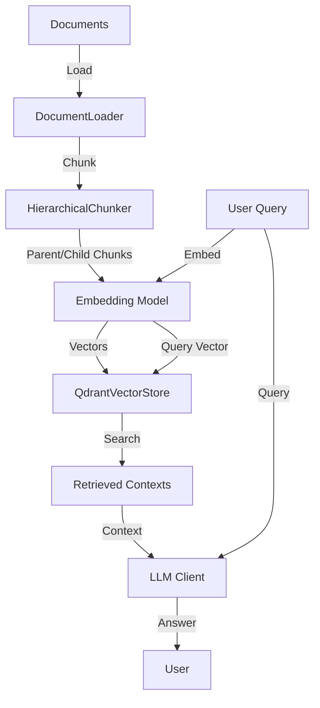

# Vi-RAG Framework

**Vietnamese Retrieval-Augmented Generation Framework**

Một framework RAG toàn diện được thiết kế đặc biệt cho tiếng Việt, hỗ trợ xử lý tài liệu PDF, TXT, DOCX với khả năng chunking phân cấp và tìm kiếm ngữ nghĩa.

[](https://www.python.org/downloads/)
[](https://opensource.org/licenses/MIT)

## 🌟 Tính Năng Chính

- ✅ **Hỗ trợ đa định dạng**: PDF, TXT, DOCX
- ✅ **Chunking thông minh**: Phân cấp parent-child chunks với overlap
- ✅ **Vector Search**: Tích hợp Qdrant cho tìm kiếm ngữ nghĩa
- ✅ **Gemini Integration**: Sử dụng Gemini API cho embedding và generation
- ✅ **In-memory Caching**: Cache DocumentNode để tăng tốc độ xử lý
- ✅ **Auto-chunking**: Tự động load và chunk documents trong 1 bước
- ✅ **Tiếng Việt native**: Được thiết kế tối ưu cho tiếng Việt

## 📁 Cấu Trúc Project

```
d:\PBL-2025\
├── src/                          # Source code chính
│   ├── api/                      # API endpoints (future)
│   ├── config/                   # Configuration management
│   │   ├── __init__.py
│   │   └── settings.py          # Environment variables & settings
│   ├── core/                     # Core data structures
│   │   ├── __init__.py
│   │   └── document.py          # DocumentNode class
│   ├── ingestion/                # Document loading & processing
│   │   ├── __init__.py
│   │   ├── loader.py            # PDFLoader, TXTLoader, DOCXLoader
│   │   └── chunker.py           # HierarchicalChunker
│   ├── models/                   # AI models integration
│   │   ├── __init__.py
│   │   ├── embedding.py         # GeminiEmbeddingModel
│   │   ├── gemini_llm.py        # GeminiLLMClient
│   │   └── prompt.py            # PromptBuilder
│   ├── retrieval/                # Retrieval components
│   │   ├── __init__.py
│   │   ├── qdrant.py            # QdrantVectorStore
│   │   ├── docstore.py          # DocStore protocol
│   │   ├── parent_child_retriever.py
│   │   ├── reranker.py          # Reranking logic
│   │   └── bm25_index.py        # BM25 search
│   └── secret/                   # Secret management
│       ├── __init__.py
│       └── .env                 # Environment variables (gitignored)
│
├── testing/                      # Test files & examples
│   ├── code/
│   │   └── demo/
│   │       ├── complete_example.py       # Complete RAG workflow
│   │       ├── handle_cached_document.py
│   │       └── example_usage.py
│   ├── data/                     # Test documents
│   └── evaluation/
│       └── test_ragas_evaluation.py
│
├── docs/                         # Documentation
│   ├── SYSTEM_LOGIC.md          # System architecture
│   ├── EVALUATION.md            # RAGAS evaluation guide
│   └── ...
│
├── .agent/                       # Agent workflows
│   └── workflows/
│       └── virag-workflow.md
│
├── requirements.txt              # Python dependencies
├── QUICKSTART.md                # Quick start guide
├── .env.example                 # Example environment file
└── README.md                    # This file
```

## 🚀 Cài Đặt Nhanh

### 1. Clone Repository

```bash
git clone https://github.com/NOT-erorr/PBL_2025_Vi-RAG_framework.git
cd PBL_2025_Vi-RAG_framework
```

### 2. Tạo Virtual Environment

```bash
python -m venv venv

# Windows
venv\Scripts\activate

# Linux/Mac
source venv/bin/activate
```

### 3. Cài Dependencies

```bash
pip install -r requirements.txt
```

### 4. Cấu Hình Environment

Tạo file `.env` từ `.env.example`:

```bash
cp .env.example src/secret/.env
```

Điền API keys vào `src/secret/.env`:

```bash
GEMINI_API_KEY=your_gemini_api_key_here
QDRANT_API_KEY=your_qdrant_api_key_here
QDRANT_URL=https://your-qdrant-instance.cloud.qdrant.io
```

## 💡 Sử Dụng Cơ Bản

### Example 1: Load và Chunk Document Tự Động

```python
from src.ingestion import DocumentLoader

# Auto-chunking (khuyến nghị)
loader = DocumentLoader(
    "document.pdf",
    auto_chunk=True,
    parent_size=2000,
    child_size=400,
    overlap=50
)

# Load và chunk trong 1 bước
document, parents, children = loader.load_and_chunk()

print(f"Loaded: {document.title}")
print(f"Parent chunks: {len(parents)}")
print(f"Child chunks: {len(children)}")
```

### Example 2: Workflow Hoàn Chỉnh RAG

```python
from src.ingestion import DocumentLoader
from src.models import GeminiEmbeddingModel, GeminiLLMClient
from src.retrieval import QdrantVectorStore
from src.secret import GEMINI_API_KEY, QDRANT_API_KEY, QDRANT_URL
import uuid

# 1. Load và chunk document
loader = DocumentLoader("document.pdf", auto_chunk=True)
document, parents, children = loader.load_and_chunk()

# 2. Setup models
embedding_model = GeminiEmbeddingModel(GEMINI_API_KEY, output_dimensionality=768)
llm = GeminiLLMClient(GEMINI_API_KEY, model_name="gemini-2.0-flash-exp")

# 3. Generate embeddings
child_texts = [child['text'] for child in children]
vectors = embedding_model.embed_documents(child_texts)

# 4. Setup và index vào vector store
vector_store = QdrantVectorStore(api_key=QDRANT_API_KEY, url=QDRANT_URL)
vector_store.connect()
vector_store.ensure_collection()

# Add IDs
for child in children:
    child['id'] = str(uuid.uuid4())

vector_store.add_vectors(
    vectors=vectors,
    payloads=children,
    ids=[c['id'] for c in children]
)

# 5. Query và generate answer
question = "Tài liệu này nói về gì?"
query_vector = embedding_model.embed_query(question)
results = vector_store.search(query_vector, top_k=5)
context = "\n\n".join([r['text'] for r in results])

answer = llm.generate(query=question, context=context)
print(f"Câu hỏi: {question}")
print(f"Trả lời: {answer}")
```

### Example 3: Xử Lý Document Cache

```python
from src.ingestion import DocumentLoader

loader = DocumentLoader("document.pdf")

# Check cache trước khi load
cached = loader.check_document_loaded()
if cached:
    print("Document đã được load trước đó!")
    document = cached
else:
    print("Loading document mới...")
    document = loader.load()
```

### Example 4: Xử Lý Nhiều Documents

```python
from src.ingestion import DocumentLoader
import uuid

documents = ["doc1.pdf", "doc2.txt", "doc3.docx"]
all_children = []

# Load tất cả documents
for doc_path in documents:
    loader = DocumentLoader(doc_path, auto_chunk=True)
    doc, parents, children = loader.load_and_chunk()
    
    # Add source metadata
    for child in children:
        child['id'] = str(uuid.uuid4())
        child['source_file'] = doc_path
    
    all_children.extend(children)

print(f"Total chunks from all documents: {len(all_children)}")

# Embed và index tất cả
texts = [c['text'] for c in all_children]
vectors = embedding_model.embed_documents(texts)
vector_store.add_vectors(vectors, all_children, [c['id'] for c in all_children])
```

### Example 5: Load Document Không Auto-Chunk

```python
from src.ingestion import DocumentLoader, HierarchicalChunker

# Load document only
loader = DocumentLoader("document.pdf", auto_chunk=False)
document, _, _ = loader.load_and_chunk()  # Empty lists returned

# Chunk thủ công sau
chunker = HierarchicalChunker(
    parent_size=3000,  # Custom size
    child_size=500,
    overlap=100
)
parents, children = chunker.build_chunks(document)
```

### Example 6: Query với Filtering

```python
from qdrant_client.models import Filter, FieldCondition, MatchValue

# Search với filter theo source file
results = vector_store.client.search(
    collection_name=vector_store.collection_name,
    query_vector=query_vector,
    limit=5,
    query_filter=Filter(
        must=[
            FieldCondition(
                key="source_file",
                match=MatchValue(value="important_doc.pdf")
            )
        ]
    )
)
```

### Example 7: Multilingual - Tiếng Việt

```python
from src.ingestion import DocumentLoader
from src.models import GeminiLLMClient

# Load Vietnamese document
loader = DocumentLoader("tai_lieu_tieng_viet.pdf", auto_chunk=True)
document, parents, children = loader.load_and_chunk()

# Query bằng tiếng Việt
question = "Nội dung chính của tài liệu là gì?"
results = vector_store.search(query_vector, top_k=5)
context = "\n\n".join([r['text'] for r in results])

# Generate với instruction tiếng Việt
llm = GeminiLLMClient(GEMINI_API_KEY)
answer = llm.generate(
    query=question,
    context=context
)

print(f"Trả lời: {answer}")
```

### Example 8: Batch Processing với Retry

```python
from src.models import GeminiEmbeddingModel
import time

embedding_model = GeminiEmbeddingModel(GEMINI_API_KEY)

def embed_with_retry(texts, max_retries=3):
    """Embed với retry logic"""
    for attempt in range(max_retries):
        try:
            return embedding_model.embed_documents(texts)
        except Exception as e:
            if attempt < max_retries - 1:
                wait_time = 2 ** attempt  # Exponential backoff
                print(f"Retry {attempt + 1}/{max_retries} sau {wait_time}s...")
                time.sleep(wait_time)
            else:
                raise e

# Batch processing
batch_size = 100
all_vectors = []

for i in range(0, len(child_texts), batch_size):
    batch = child_texts[i:i + batch_size]
    vectors = embed_with_retry(batch)
    all_vectors.extend(vectors)
    print(f"Processed {i + len(batch)}/{len(child_texts)}")
```

## 📖 Ví Dụ Hoàn Chỉnh

Xem `testing/code/demo/complete_example.py` để có ví dụ đầy đủ về workflow:

```bash
python -m testing.code.demo.complete_example
```

## 🏗️ Kiến Trúc Hệ Thống



## 📊 Key Components

### 1. Document Loading
- **PDFLoader**: Xử lý PDF với PyPDF hoặc PyMuPDF
- **TXTLoader**: Hỗ trợ nhiều encoding
- **DOCXLoader**: Xử lý Word documents
- **MD5 Caching**: Tự động phát hiện duplicate documents

### 2. Chunking
- **HierarchicalChunker**: Tạo parent-child chunks
- **Configurable**: Tùy chỉnh size và overlap
- **Context Preservation**: Giữ ngữ cảnh qua overlap

### 3. Embedding
- **GeminiEmbeddingModel**: Sử dụng Gemini `embedding-001`
- **768 dimensions**: Tối ưu cho tiếng Việt
- **Batch processing**: Xử lý hàng loạt hiệu quả

### 4. Vector Storage
- **QdrantVectorStore**: Integration với Qdrant Cloud/Local
- **COSINE similarity**: Đo độ tương đồng ngữ nghĩa
- **Metadata storage**: Lưu trữ thông tin bổ sung

### 5. Generation
- **GeminiLLMClient**: Multi-model support
- **PromptBuilder**: Template-based prompts
- **Context-aware**: Generate dựa trên retrieved context

## 🧪 Testing

### Run Basic Tests

```bash
# Test document loading
python -m testing.code.demo.example_usage

# Test complete workflow
python -m testing.code.demo.complete_example
```

### Run Unit Tests (if available)

```bash
pytest tests/
```

## 📚 Documentation

- **[QUICKSTART.md](QUICKSTART.md)**: Hướng dẫn bắt đầu nhanh
- **[SYSTEM_LOGIC.md](docs/SYSTEM_LOGIC.md)**: Kiến trúc chi tiết
- **[EVALUATION.md](docs/EVALUATION.md)**: Đánh giá với RAGAS
- **[Workflow](\.agent\workflows\virag-workflow.md)**: Workflow đầy đủ

## 🔧 Configuration

### Environment Variables

| Variable | Description | Default |
|----------|-------------|---------|
| `GEMINI_API_KEY` | Gemini API key | Required |
| `QDRANT_API_KEY` | Qdrant API key | Required |
| `QDRANT_URL` | Qdrant server URL | Required |
| `QDRANT_COLLECTION_NAME` | Collection name | `rag_documents` |
| `EMBEDDING_DIM` | Embedding dimension | `768` |
| `QDRANT_VECTOR_DIM` | Vector dimension | `768` |
| `VECTOR_TOP_K` | Top K results | `5` |

### Chunking Parameters

```python
DocumentLoader(
    file_path="document.pdf",
    auto_chunk=True,
    parent_size=2000,    # Parent chunk size
    child_size=400,      # Child chunk size
    overlap=50           # Overlap between chunks
)
```

## 🤝 Contributing

Contributions are welcome! Please feel free to submit a Pull Request.

## 📝 License

This project is licensed under the MIT License - see the [LICENSE](LICENSE) file for details.

## 📧 Contact

- **Author**: Vi-RAG Team
- **GitHub**: [NOT-erorr/PBL_2025_Vi-RAG_framework](https://github.com/NOT-erorr/PBL_2025_Vi-RAG_framework)

## 🙏 Acknowledgments

- Google Gemini API for embeddings and generation
- Qdrant for vector storage
- Contributors and testers

---

**Made with ❤️ for Vietnamese NLP community**
